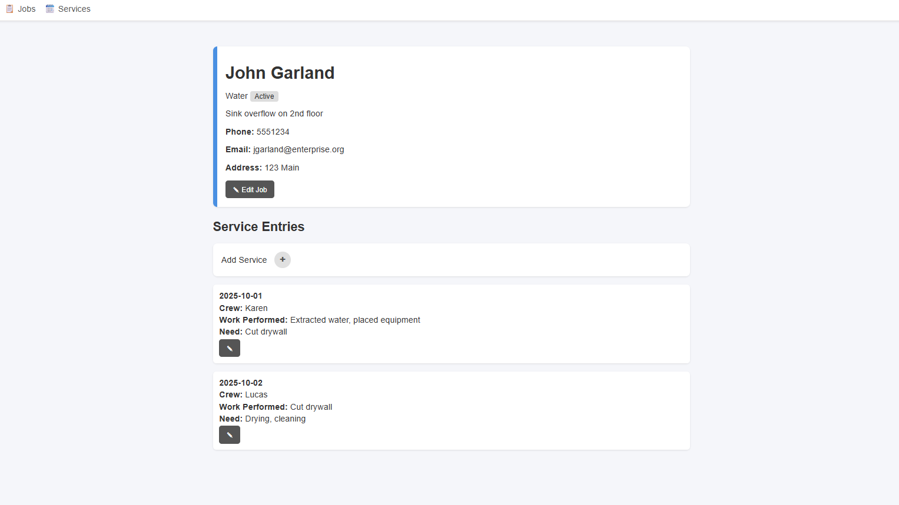

# Job Tracker

This is a program developed for use in a water-restoration setting (or any other service-based job such as plumbing, electric, etc.) to help keep track of jobs, customers, and services performed at each job. It is developed in Java using the Spring framework, uses PostgreSQL, and supports CRUD operations.

Here are some screenshots of the program in use with example data:

To get started, set up PostgreSQL on your local machine and create a database called `job-tracker`. In `src/main/resources` set up your `application.properties` file as in the example. When the application starts up, navigate to `http://localhost:8080/view/customers` - you will be able to add customers, jobs, and services which will populate the database automatically.

Support for importing/exporting JSON files to the database is planned for a future release.

## Roadmap
- [X] Initialize Project
- [X] Create page for Customers
- [X] Create page for Jobs
- [X] Create page for Service Entries
- [X] Connect database to PostgreSQL
- [ ] Implement CRUD operations for Customers, Jobs, and Services
  - [X] Add new Customers
  - [X] Add new Jobs to Customers
  - [X] Add new Services to Jobs
  - [X] Edit Customer information
  - [X] Edit Job information
  - [ ] Edit Service information
  - [ ] Delete Customers (and all sub-jobs and services)
  - [ ] Delete Jobs (and all sub-services)
  - [ ] Delete services
- [ ] Allow import/export JSON files to database
- [ ] Re-add schedule view
- [ ] --**Minimum Viable Product**--